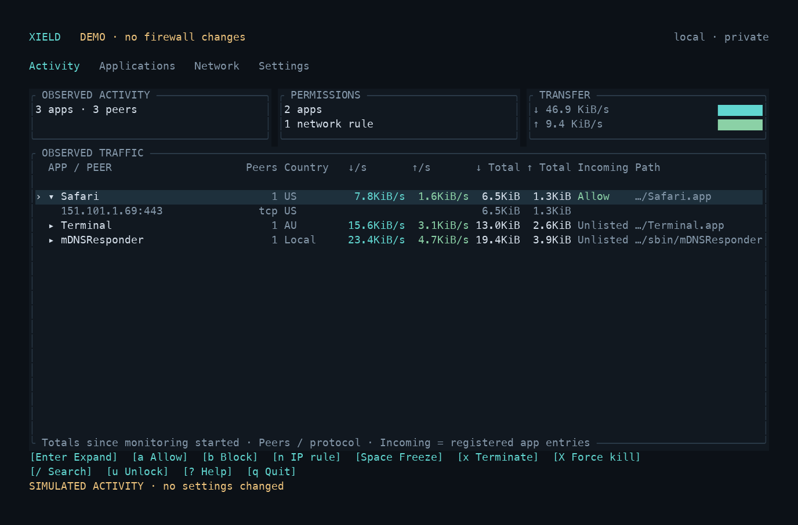

# Xield

A compact Rust TUI for macOS firewall settings, network rules, and app traffic.
Manage incoming permissions, inspect connections and countries, and apply
machine-wide network rules from one terminal.



One executable. Keyboard and mouse navigation. No Swift companion, system
extension, Apple Developer account, or notarization workflow for source installs.

## Quick start

Requires **macOS**, **Rust 1.88+**, and the macOS command-line build tools.
Clone this repository, open its directory, and install from source:

```sh
cargo install --path . --locked
xield --demo
```

Demo mode uses simulated traffic and in-memory permissions. It never changes
firewall settings, downloads country data, or sends process signals. Separate
CLI invocations start separate demo sessions.

For your Mac's actual state, run as your normal user:

```sh
xield doctor
xield
```

Launching Xield does not activate or change either firewall. Administrator
access is requested when needed through normal `sudo` authentication; you do
not need to run the whole app with `sudo`.

Without installing, use `cargo run --locked -- --demo` or
`cargo run --release --locked --`. Use at least **80 × 24** for comfortable
navigation; the minimum is 50 × 17. No patched font is required.

## Features and scope

| View | What you can do | Backend and scope |
| --- | --- | --- |
| Activity | View app and helper traffic, peers, countries, rates, and totals; inspect peers; review process termination | Observed activity from macOS `nettop` |
| Applications | Add, allow, block, and remove registered incoming permissions | macOS application firewall (`socketfilterfw`) |
| Network | Add, edit, reorder, and toggle IP/CIDR, port, protocol, direction, and interface rules | PF rules for every application on the Mac |
| Settings | Turn the incoming firewall on/off; manage stealth, block-all, signed-app defaults, and country data | macOS application firewall and local GeoIP database |

Xield also provides JSON status, configuration profiles, rule previews, and
light/monochrome themes:

```sh
xield status
xield --theme light
xield --theme mono
```

**Status: early release.** Local checks cover the Rust implementation, native
process identity/signaling, live observation, and terminal interaction on Apple
silicon. Privileged firewall mutation, actual blocked/allowed connectivity,
VPN coexistence, and reboot behavior still need isolated integration testing.
Intel Macs and older macOS versions have not been verified.

The built-in controls do not provide outgoing per-app blocking or interactive
approval of every new connection. Activity is sampled observation, not packet
capture, a firewall verdict, or a complete log of blocked attempts. An allow
rule in one firewall does not bypass another firewall or PF anchor. Automatic
startup and timed network-rule expiry are not implemented.

## Incoming firewall

In Settings, select **Application firewall**, press `Enter`, and review the
on/off change. Applications lets you register a bundle or executable with `n`
and review incoming permissions with `a` / `b`.

The following CLI commands read state or explicitly request changes:

```sh
xield firewall status
xield apps list
xield apps add /Applications/Example.app
xield apps block /Applications/Example.app
xield apps allow /Applications/Example.app
xield apps remove /Applications/Example.app
xield firewall set firewall on
xield firewall set stealth on
```

Replace the example with an installed app. A bundle is resolved through its
`CFBundleExecutable` metadata to the executable macOS registers. CLI
allow/block/remove preserve an exact listed path or resolve a bundle to its
registered main executable; they affect one registration.

Wide Activity rows show incoming permissions as `Allow`, `Block`, `Mixed`,
`Unlisted`, or `Unknown`. `Mixed` means registered entries in the same verified
app bundle have different permissions. Activity's `a` / `b` actions confirm
all registered entries for that bundle; Applications actions affect the selected
entry. These labels describe listed permissions, not an observed packet verdict.

TUI firewall changes require confirmation. Scroll long confirmations with ↑↓,
Page Up/Down, Home/End, or the mouse wheel to review every target. Xield validates
targets before changing them and verifies each result. Application firewall
operations are sequential; partial failures identify affected entries.

Authentication happens outside terminal raw mode. Xield never collects or stores
passwords, and worker commands use noninteractive `sudo`. Quitting waits for an
authorized mutation to finish. Applied settings remain after Xield exits.

## Optional network rules

Incoming application permissions work independently of PF. To use Xield's
machine-wide network rules, explicitly install its dedicated anchor:

```sh
xield network setup
xield network add 203.0.113.0/24 --name 'Example destination' --action block --direction out
xield network add any --port 8080 --protocol tcp --direction in --name 'Incoming example'
xield network status
```

These commands change network policy and may affect connectivity. Setup accepts
Apple's stock parent PF layout and refuses unsupported custom parent rules.
Rules match a remote peer: source IP for incoming traffic, destination IP for
outgoing traffic. The port is the destination service port: local for incoming,
remote for outgoing. The first matching enabled rule inside Xield's anchor wins.

Xield preserves other anchors and existing connection states. Established
connections may therefore continue after a rule changes. To clear Xield's rules
and release its PF enable reference, or remove the setup:

```sh
xield network disable
xield network remove
```

Another service may keep PF enabled. Rules are not automatically reapplied at
boot. See [PF configuration and lifecycle](docs/network.md) for JSON rule files,
read-only previews, backups, drift checks, persistence, and restoration limits.

## Countries and traffic

Country lookup is optional. Install the managed database once:

```sh
xield geoip update
```

Or press `g` in Settings / click **Update countries**. This explicitly downloads
[DB-IP Country Lite](https://db-ip.com/db/download/ip-to-country-lite), validates
it, and atomically installs it at
`~/Library/Application Support/xield/geoip/Country.mmdb`. No account, API key,
or sudo is needed. Later launches load it automatically; a running TUI also
picks up replacements.

Lookups stay offline and cached. Observed endpoint addresses are never sent to
the provider. Downloads happen only when requested, and failed updates retain
the previous database. Settings shows attribution and database age. The Lite
database is updated monthly and has reduced coverage and accuracy.

IP geolocation by [DB-IP](https://db-ip.com/), licensed under
[CC BY 4.0](https://creativecommons.org/licenses/by/4.0/). Xield uses the
unmodified database. Country labels estimate the observed IP's location; CDNs,
VPNs, proxies, and anycast can make that different from an app's actual service
location. Local/private peers show `Local`; missing data shows `Unknown`.

Activity rows show peer counts, country summaries, download/upload rates, and
received/sent totals without selecting an app. Expand an app to see its peers;
`Enter` on a peer opens the full endpoint. Wider windows add incoming permissions
and application paths.

Rates use elapsed time between samples. Totals start at the first observation
and preserve contributions across helper exits. Process totals are authoritative;
child-flow totals are not added again. Peer counts represent observed
endpoint/port/protocol combinations, not socket counts. Peer rates are unavailable.
Short connections, hidden processes, and wildcard UDP peers may be absent.
Helpers are grouped by verified app paths; unresolved processes stay separate.

## Keyboard and mouse

| Key | Action |
| --- | --- |
| `Tab`, `1`–`4` | Switch views |
| `↑↓`, `j` / `k` | Move selection |
| `Enter` | Expand peers, inspect a peer, edit a network rule, or review a setting |
| `a` / `b` | Review incoming allow/block permissions |
| `n` | Add an app in Applications or a network rule in Activity/Network |
| `d` | Remove a registered app entry or network rule |
| `t`, `+` / `-` | Toggle or reorder a network rule |
| `/`, `Esc` | Search; clear search or cancel a dialog |
| `Space` in Activity | Freeze traffic display; firewall status still refreshes |
| `x` / `X` in Activity | Review termination / force kill of the app and captured helpers |
| `u` | Authenticate for privileged reads and changes |
| `g` in Settings | Install/update country data |
| `?`, `q`, `Ctrl-C` | Help; quit |

Click tabs, rows, footer shortcuts, and dialog buttons. Double-click a row to
expand activity, inspect a peer, edit a rule, or review an app permission or
setting. Click Activity's expand indicator once to expand/collapse. The mouse
wheel moves selection over lists and scrolls confirmation text. In the network
editor, click text fields to focus and choice fields to cycle values.

Mouse navigation needs a terminal with mouse reporting. Capture is suspended
during authentication and released when Xield exits.

`x` requests `SIGTERM`, which an app can ignore. `X` requests `SIGKILL` through a
separate confirmation. Both list every captured PID and executable path, including
helpers without traffic. Unsaved work may be lost, and apps may restart.

Termination needs no sudo for your own processes. Xield rechecks ownership and
kernel process identity before signaling, protects root-owned processes, itself,
and ancestors, and refuses stale targets. If identity-bound signaling is
unavailable on the host, termination fails explicitly. Signal delivery does not
guarantee that a process has exited.

## Profiles

```sh
xield profile export profile.json
xield profile check profile.json
xield profile apply profile.json --yes
```

Exports contain incoming settings, registered app entries, and saved network
rules. Run `sudo -v` in the same terminal before export so PF state can be read.
Export refuses to overwrite a file. Check validates the strict schema without
applying it. Unknown fields and unsupported formats are rejected.

Apply replaces those scopes, resolves bundle paths before mutation, and rejects
duplicate resolved registrations. Failures trigger best-effort restoration and
report restoration failures explicitly. Profiles containing network rules
require prior PF setup. Review exported files before sharing: they contain app
paths and network policy.

## Development and packaging

```sh
make check
make test
make release
make package
```

Checks run formatting, all-target compiler checks, and Clippy with warnings as
errors. Tests cover command formats, grouping, counters, strict validation,
configuration drift, cancellation, confirmations, mouse geometry, and rendering.
Tests do not change the host firewall; PF syntax checks use `pfctl -n`, and native
signal tests target only processes they create. GitHub Actions runs checks on macOS.

`make package` creates an unsigned archive for the current Mac architecture in
`target/package/`, with the binary, README, license, and PF documentation.
Downloaded unsigned binaries may encounter Gatekeeper. Installing from source
is the supported path and requires no signing or notarization.

Contributions are welcome. Follow [AGENTS.md](AGENTS.md), run the checks above,
and keep live firewall integration tests in an isolated environment. Bug reports
should include the macOS version, terminal, Xield version, and relevant
`xield doctor` output. Redact app paths, addresses, and other private information.

## License

Xield's source code is [MIT licensed](LICENSE). The optional DB-IP country data
has its own [CC BY 4.0 license](https://creativecommons.org/licenses/by/4.0/).
The synthetic MaxMind database used in tests is Apache 2.0 licensed; its provenance
and license are retained in [tests/data](tests/data/README.md). Production country
data is downloaded explicitly and is not bundled in this repository or packages.
