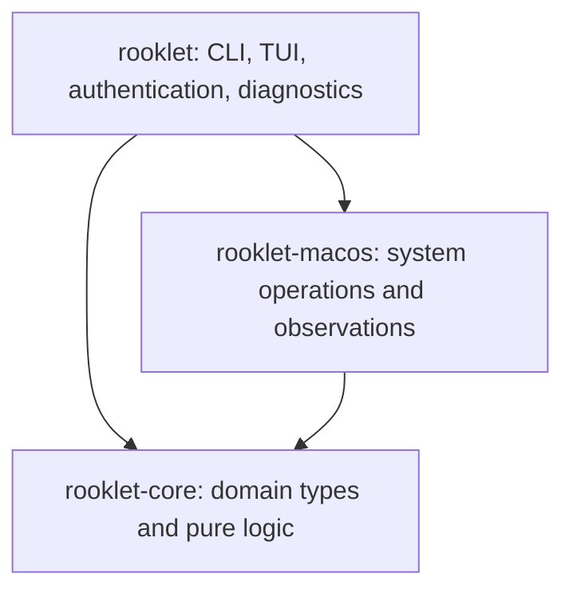
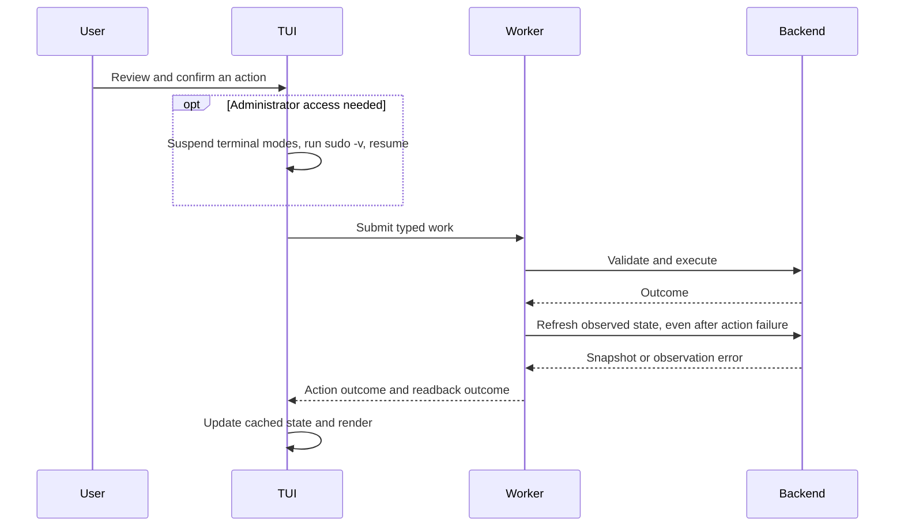

# Architecture

Rooklet is a macOS terminal application distributed as one Rust executable.
It combines incoming application firewall controls, scoped PF configuration,
and local observations. These backends have different authority: traffic
observation and country labels do not establish an enforcement verdict.

This document describes the current implementation. Significant decisions and
their alternatives are recorded in [ADRs](adr/README.md); user-visible behavior
is documented in [functional.md](functional.md).

## Packages and dependencies

| Package | Owns | Boundary |
| --- | --- | --- |
| `rooklet-core` | Schemas, captured evidence, validation, grouping/projection, PF compilation and hypothetical analysis, text sanitization | No production filesystem, network, subprocess, native API, UI, or CLI framework work |
| `rooklet-macos` | ALF/PF adapters, native process identity/signaling, activity/resource collection, GeoIP, profile storage and application | Typed facades; parsers, command execution, native collection, and transaction internals remain private |
| `rooklet` | Binary entry point, Clap commands, sudo authentication, terminal lifecycle, interaction state, rendering, worker coordination, file diagnostics | Rendering and input handlers consume cached data and produce typed effects; they do not perform system work |

The root package also exposes `app` and `ui` as a library for interaction and
rendering tests. Internal workspace libraries are not independently published
APIs. Shared dependency versions, edition, MSRV, and Rust lints live in the root
[Cargo.toml](../Cargo.toml). See [ADR 0002](adr/0002-workspace-responsibilities.md).

## Runtime and interaction

The binary parses CLI arguments before starting optional logging. An explicit
subcommand runs synchronously through the appropriate facade. Without a
subcommand, it starts the TUI after verifying that stdin and stdout are terminals.

The TUI owns the terminal, `App` interaction state, and rendering state. The
backend worker initializes system observations away from the first frame. Input
produces typed effects for authentication, mutation, profile work, GeoIP updates,
or confirmed termination. Keyboard and mouse routes share these effects.

Work and response channels each have capacity one. One explicit operation is in
flight at a time; accepted work takes priority over routine observations. Routine
polling is approximately once per second and observations can be coalesced.
Resource interest and refresh requests replace shared state rather than queueing
sampling jobs. Quitting waits for accepted work; cancellation must not interrupt
an authorized PF transaction or its restoration. Terminal restoration and backend
shutdown both finish before the diagnostic writer is drained. See
[ADR 0003](adr/0003-bounded-system-work.md).

Selection is keyed to stable app, peer, registration, or rule identities rather
than row positions. Freezing Activity retains traffic, resources, and captured
path evidence together while current firewall controls continue refreshing.
Pointer targets come from the rendered geometry; active dialogs block targets
underneath them.

## System and privilege boundaries

| Adapter | Mechanism | Authority |
| --- | --- | --- |
| Incoming firewall | Fixed `socketfilterfw` executable and bounded output parsers | Incoming application registrations and ALF settings |
| Network rules | Fixed `pfctl`, pure compiler, trusted persistence, lifecycle transactions | Machine-wide rules in Rooklet's managed PF anchor |
| Traffic | Long-lived `nettop` subprocess and incremental CSV/counter processing | Best-effort process and peer observations |
| Processes/resources | Narrow native macOS wrappers and private sampling/signaling engines | Captured identities, resource counters, and identity-bound signals |
| Country labels | Validated local MMDB reader and bounded lookup cache | Estimated address location, with explicit local/unknown states |

The application runs as the normal user. Authentication uses `/usr/bin/sudo -v`
outside raw mode. Backend privileged subprocesses use noninteractive sudo and
never collect passwords. PF requests can invoke the canonical current executable
as a privileged CLI helper with bounded input. There is no daemon, RPC layer,
system extension, or app bundle.

Commands use trusted executable paths and argument arrays. Output sizes,
deadlines, cancellation, and child cleanup are supervised. Ordinary subprocesses
have isolated groups cleaned before the leader is reaped; the accepted PF helper
has separate supervision so cancellation or an I/O problem cannot abandon its
transaction. Native wrappers document buffer, layout, ownership, and lifetime
contracts at each unsafe boundary.

Configuration is validated before mutation and successful changes are read back.
PF operations preserve unrelated anchors, states, and enable references, and
reject unsupported layouts or inconsistent managed state. ALF changes are
sequential; profile application rechecks its reviewed baseline, preflights PF,
verifies all scopes, and attempts restoration on failure. These operations do
not claim cross-backend atomicity. See
[ADR 0004](adr/0004-explicit-verified-firewall-mutations.md) and the
[PF guide](network.md).

Termination captures the exact targets and requested signal for confirmation.
The backend rechecks ownership, executable identity, start time, and kernel PID
generation, protects self/ancestors/root-owned processes, and uses identity-bound
signaling without a PID-only fallback. See
[ADR 0008](adr/0008-identity-bound-process-signaling.md).

## Observation and freshness

Routine ALF/PF control observations are cached for up to five seconds and expose
their age. Explicit snapshots, refreshes, mutation readback, and profile
preparation/application use fresh reads. Unavailability replaces prior success;
cached state is never used to authorize a mutation.

Traffic accounting treats process summaries as authoritative rather than adding
their flows again. App grouping uses verified paths and preserves cumulative
contributions across helper exits. Rates and totals are distinct. Peer data can
be incomplete, and unresolved identities remain separate.

Resource sampling is driven by actual viewport, inspector, and sort interest.
Native counters are collected on a two-second interval, discovery on a five-second
interval, with a 4096-process bound and a cooperative 20 ms budget per observation.
Work resumes incrementally, prioritizing visible apps while retaining fair
rotation. Individual native calls can exceed that cooperative budget. Disabling
resource interest resets rate baselines; it does not stop `nettop`. Missing,
warming, partial, and stale readings remain explicit. See
[ADR 0005](adr/0005-local-demand-driven-observations.md).

Country lookups remain offline. Explicit updates download the provider database,
validate it before atomic replacement, and preserve previous data on failure.
Running sessions detect replacement without background installation. See
[ADR 0006](adr/0006-offline-country-data.md).

## Persistence and data ownership

| Data | Location | Owner and lifecycle |
| --- | --- | --- |
| Incoming settings/registrations | macOS-managed ALF state | System-owned; modified through the adapter |
| PF parent reference and anchor | `/etc/pf.conf`, `/etc/pf.anchors/rooklet` | Root-owned, validated; setup/removal back up parent configuration |
| PF metadata and enable token | `/Library/Application Support/Rooklet/network.json` | Root-owned private state with bounded atomic writes and mutation locking |
| PF configuration backups | `/etc/pf.conf.rooklet-backup-*` | Retained for explicit recovery |
| Named TUI profiles | `~/Library/Application Support/rooklet/profiles/` | Private current-user files; save refuses overwrite |
| Country database | `~/Library/Application Support/rooklet/geoip/Country.mmdb` | Explicit current-user install/update; old valid data survives failed updates |
| Diagnostic logs | Explicit `--log-dir` | Private current-user JSONL; bounded queue, records, files, and retention |
| CLI profile export | Explicit output path or stdout | Contains application paths and network policy; file export refuses overwrite |

The capitalization of the system PF directory and per-user data directory is
intentional and reflects current paths. Strict schemas reject unsupported formats
and unknown fields; there are no legacy migrations or aliases. Installation and
uninstallation change the executable only, not these data or live firewall state.

## Diagnostics and untrusted text

The binary owns the `tracing-subscriber` and bounded file writer; the macOS crate
emits explicit fields and the core remains independent of logging. Logs are off
by default. Paths, endpoints, names, configuration, command arguments/output,
process metadata, and raw error display are excluded at every level. Privileged
helpers do not inherit the sink. Failed/stalled file I/O stays silent, and shutdown
waits at most one second. [ADR 0007](adr/0007-private-bounded-diagnostics.md)
contains the decision, event map, and logging contract.

Human terminal output sanitizes control and bidi characters at presentation
boundaries. Exact identities and mutation targets stay unchanged in state;
structured JSON output preserves domain values.

## Source and validation map

| Area | Entry points and checks |
| --- | --- |
| CLI and authentication | [`src/cli/`](../src/cli/), [`src/auth.rs`](../src/auth.rs); CLI output, validation, and logging regressions in root `tests/` |
| Interaction and rendering | [`src/app/`](../src/app/), [`src/ui/`](../src/ui/); cached-fixture navigation, selection, dialogs, mouse, and terminal-cell rendering tests |
| Worker and terminal lifecycle | [`src/tui/`](../src/tui/); bounded work, shutdown, and readback failure tests |
| Domain | [`rooklet-core`](../crates/rooklet-core/); portable parser, schema, compiler, analysis, and grouping tests |
| System operations | [`rooklet-macos`](../crates/rooklet-macos/); fake transaction adapters, native identity/counter checks, harmless subprocesses, and owned-child signal tests |
| Release | [`scripts/`](../scripts/), [`Makefile`](../Makefile), [CI](../.github/workflows/check.yml); explicit target builds and verified binary archives |

`make check`, `make test`, and `make package` cover the macOS workspace. CI also
checks the core on Linux. UI changes require inspection of actual Ratatui cells
at multiple sizes. Tests do not mutate the host firewall; privileged mutation,
connectivity, VPN coexistence, and reboot behavior still require isolated live
integration testing. Intel and older macOS runtime coverage remains unverified.
